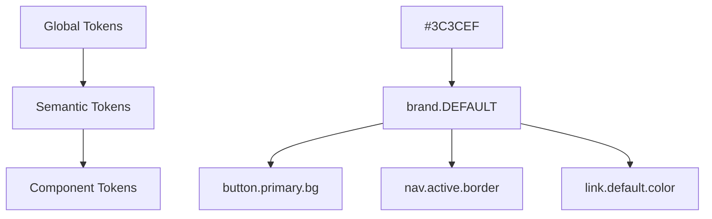
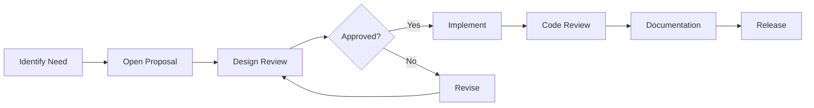
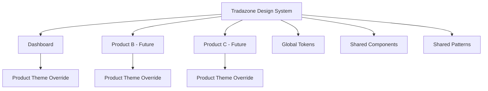

# Tradazone Design System

**Version:** 1.0.0  
**Status:** Active  
**Last Updated:** February 22, 2026  
**Maintained by:** Tradazone Design Engineering

---

## Table of Contents

1. [Introduction](#1-introduction)
2. [Foundations](#2-foundations)
3. [Design Tokens Architecture](#3-design-tokens-architecture)
4. [Component Library](#4-component-library)
5. [Patterns & Layout Systems](#5-patterns--layout-systems)
6. [Governance & Scalability](#6-governance--scalability)
7. [Cross-Product Consistency Strategy](#7-cross-product-consistency-strategy)

---

## 1. Introduction

### 1.1 Purpose

This design system is the single source of truth for the Tradazone platform. It defines the visual language, interaction patterns, component specifications, and governance model that ensure consistency, quality, and velocity across every area of the product.

### 1.2 Design Philosophy

Tradazone follows four core design principles:

| Principle | Definition |
|-----------|-----------|
| **Clarity** | Every element communicates its purpose without ambiguity. Interfaces are scannable, information-dense, and silent where silence serves the user. |
| **Precision** | Pixel-level consistency. No approximations. Spacing, typography, and alignment follow the system — never ad-hoc values. |
| **Composability** | Components are atomic, self-contained, and composable. A button behaves identically whether it lives in a dashboard, a modal, or a marketing page. |
| **Durability** | Decisions are made for the long term. Every token, component, and pattern is built to scale across products, themes, and platforms without architectural rewrites. |

### 1.3 Brand Identity

- **Tone:** Professional, technical, trustworthy
- **Visual Character:** Clean geometry, sharp edges, structured layouts, data-forward interfaces
- **Personality:** A system that works hard behind the scenes — users feel confident, never confused

### 1.4 Products Covered

| Product | Type | Status |
|---------|------|--------|
| **Tradazone** | Dashboard / SaaS | Active |
| *(Future products)* | To be registered | Planned |

All products inherit from this system. Product-specific overrides are documented in Section 7.

---

## 2. Foundations

### 2.1 Color System

#### 2.1.1 Brand Colors

| Token | Value | Usage |
|-------|-------|-------|
| `brand.DEFAULT` | `#3C3CEF` | Primary action, active states, links, focused elements |
| `brand.dark` | `#2E2ED4` | Hover states on brand elements, pressed buttons |
| `brand.light` | `#5A5AF5` | Decorative, secondary brand treatments |
| `brand.bg` | `#EDEDFD` | Active navigation background, selected row highlight |

#### 2.1.2 Accent Colors

| Token | Value | Usage |
|-------|-------|-------|
| `accent.orange` | `#F5A623` | Wallet icon, quick-action lightning bolt, warm accents |
| `accent.blue` | `#3C3CEF` | Alias of brand.DEFAULT — use `brand.DEFAULT` directly |

#### 2.1.3 Neutral / Surface Colors

| Token | Value | Usage |
|-------|-------|-------|
| `page` | `#F5F6FA` | Application background, page canvas |
| `sidebar` | `#F8FAFC` | Sidebar background |
| `white` | `#FFFFFF` | Card surfaces, inputs, modals |

#### 2.1.4 Text Colors

| Token | Value | Usage |
|-------|-------|-------|
| `t-primary` | `#1E293B` | Headings, primary body text, high-emphasis content |
| `t-secondary` | `#64748B` | Subheadings, secondary labels, nav items (inactive) |
| `t-muted` | `#94A3B8` | Timestamps, metadata, placeholders, helper text |
| `t-light` | `#CBD5E1` | Disabled text, lowest-emphasis content |

#### 2.1.5 Border Colors

| Token | Value | Usage |
|-------|-------|-------|
| `border.DEFAULT` | `#E2E8F0` | Card borders, dividers, table lines, input borders |
| `border.medium` | `#CBD5E1` | Hovered input borders, emphasized separators |

#### 2.1.6 Semantic / State Colors

Each semantic color includes a background variant for alert/badge/notification containers.

| Token | Foreground | Background | Usage |
|-------|-----------|-----------|-------|
| `success` | `#10B981` | `#D1FAE5` | Paid status, confirmed actions, positive feedback |
| `warning` | `#F59E0B` | `#FEF3C7` | Pending states, caution notices |
| `error` | `#EF4444` | `#FEE2E2` | Validation errors, destructive warnings, failed states |
| `info` | `#3B82F6` | `#DBEAFE` | Informational banners, tooltips |

#### 2.1.7 Color Usage Rules

> [!IMPORTANT]
> - Never use raw hex values in component code. Always reference design tokens.
> - Brand color is reserved for interactive elements and key indicators — never for large background fills on content pages.
> - Semantic colors must only be used for their designated semantic purpose (e.g., never use `error` red for decorative styling).

---

### 2.2 Typography

#### 2.2.1 Type Family

| Property | Value |
|----------|-------|
| **Primary** | `Inter` (Google Fonts) |
| **Fallback Stack** | `-apple-system`, `BlinkMacSystemFont`, `Segoe UI`, `sans-serif` |

Inter is loaded via CDN: `https://fonts.googleapis.com/css2?family=Inter:wght@400;500;600;700&display=swap`

#### 2.2.2 Type Scale

| Name | Size | Line Height | Weight | Usage |
|------|------|-------------|--------|-------|
| **Display** | 48px | 1.1 | 700 (Bold) | Wallet balance, hero metrics |
| **Heading 1** | 20px | 1.4 | 500 (Medium) | Page titles ("Welcome to Tradazone") |
| **Heading 2** | 16px | 1.5 | 600 (Semibold) | Card section titles, nav group headers |
| **Body** | 14px | 1.5 | 400 (Regular) | Default body text, descriptions, form labels |
| **Body Strong** | 14px | 1.5 | 600 (Semibold) | Nav items (active), table header cells |
| **Small** | 13px | 1.4 | 500 (Medium) | Transaction descriptions, list items |
| **Caption** | 12px | 1.4 | 400 (Regular) | Timestamps, stat labels, helper text |
| **Micro** | 11px | 1.3 | 400 (Regular) | Dates under transactions, secondary metadata |
| **Overline** | 10px | 1.4 | 500 (Medium) | Badges, smallest labels |

#### 2.2.3 Typography Rules

1. **Never skip heading levels.** H1 → H2 → Body is acceptable. H1 → Caption is not.
2. **Numbers are always `tabular-nums`** for right-aligned columns (amounts, dates).
3. **Currency labels** (e.g., "STRK") use one weight lighter than the numeric value beside them.
4. **Truncation:** Use `text-ellipsis` + `overflow-hidden` for single-line truncation. Never truncate numeric values or dates.

---

### 2.3 Spacing System

#### 2.3.1 Base Unit

All spacing derives from an **8px base unit**.

| Token | Value | Common Usage |
|-------|-------|-------------|
| `0.5` | 4px | Tight inner gaps (icon-to-text in small badges) |
| `1` | 8px | Minimum gap between related elements |
| `1.5` | 12px | Input inner padding (vertical) |
| `2` | 16px | Standard inner padding, gap between form fields |
| `3` | 24px | Card inner padding, section title to content |
| `4` | 32px | Main content padding (desktop), gap between cards |
| `5` | 40px | Large section spacing |
| `6` | 48px | Section-to-section vertical spacing |
| `8` | 64px | Page-level vertical rhythm |

#### 2.3.2 Layout Dimensions

| Token | Value | Usage |
|-------|-------|-------|
| `sidebar` | 250px | Fixed sidebar width (desktop) |
| `header` | 72px | Fixed header height |

#### 2.3.3 Grid System

| Property | Value |
|----------|-------|
| **Columns** | 2-column grid for dashboard cards |
| **Column Gap** | 24px (`gap-6`) |
| **Row Gap** | 24px (`gap-6`) |
| **Max Content Width** | 1100px |
| **Breakpoint** | `lg` (1024px) — switches from single to multi-column |

#### 2.3.4 Spacing Rules

> [!CAUTION]
> - Never use arbitrary pixel values. Use the 8px scale exclusively.
> - The only exceptions are the fixed layout dimensions (sidebar, header) which are design constants.
> - Margin between card sections must be consistent (`mb-6` = 24px) throughout the product.

---

### 2.4 Elevation, Shadows & Borders

#### 2.4.1 Border Radius

> [!CAUTION]
> **ZERO BORDER RADIUS — NON-NEGOTIABLE RULE**
>
> All border radius across the entire Tradazone product is **`0px`**. No exceptions. This applies to every component: cards, buttons, inputs, dropdowns, modals, alerts, search bars, containers, progress bars, and any future component added to the system.
>
> This is an intentional architectural decision. Tradazone's visual identity is defined by **sharp, geometric edges**. Rounded corners are explicitly prohibited.

| Token | Value | Usage |
|-------|-------|-------|
| `none` | **0px** | Explicit zero radius |
| `sm` | **0px** | Overridden — no small radius |
| `DEFAULT` | **0px** | Overridden — no default radius |
| `md` | **0px** | Overridden — no medium radius |
| `lg` | **0px** | Overridden — no large radius |
| `xl` | **0px** | Overridden — no extra-large radius |
| `2xl` | **0px** | Overridden — no 2xl radius |
| `3xl` | **0px** | Overridden  no 3xl radius |
| `card` | **0px** | Card components |
| `full` | **9999px** | **ONLY exception**  circular elements: avatars, status dots |

> [!WARNING]
> `rounded-full` is the ONLY border-radius permitted anywhere in the product. It is reserved exclusively for elements that must be circles (avatars, status indicator dots, icon badges). Using `rounded-lg`, `rounded-xl`, `rounded-md`, or any other radius class on any component is a **design system violation**.
>
> These overrides are enforced at the `tailwind.config.js` level, meaning any `rounded-*` class (except `rounded-full`) will automatically resolve to `0px` — even in newly created components.
#### 2.4.2 Borders

| Pattern | Specification |
|---------|--------------|
| **Card border** | `1px solid border.DEFAULT` (`#E2E8F0`) |
| **Input border** | `1px solid border.DEFAULT`, focus: `1px solid brand.DEFAULT` |
| **Divider line** | `1px solid border.DEFAULT`, full-width or with horizontal margin |
| **Active nav indicator** | `3px solid brand.DEFAULT`, left edge |

#### 2.4.3 Shadows

Shadows are used minimally. The primary elevation mechanism is **border + background contrast**.

| Level | Value | Usage |
|-------|-------|-------|
| **Level 0** | None | Default state for all cards and containers |
| **Level 1** | `0 1px 3px rgba(0,0,0,0.04)` | Hover state on interactive cards |
| **Level 2** | `0 4px 12px rgba(60,60,239,0.15)` | Quick action buttons (branded shadow) |

---

### 2.5 Motion & Interactions

#### 2.5.1 Principles

1. **Motion serves function.** Animations communicate state changes (open/close, enter/exit); they never decorate.
2. **Fast by default.** 150–300ms for most transitions. Users should never wait for an animation to complete before acting.
3. **Easing matters.** Use `cubic-bezier(0.32, 0.72, 0, 1)` for entry animations. Use `ease-out` for exits.

#### 2.5.2 Interaction Tokens

| Interaction | Duration | Easing | Usage |
|------------|----------|--------|-------|
| **Color transition** | 150ms | `ease` | Button hover, link hover, nav item hover |
| **Slide-up entry** | 300ms | `cubic-bezier(0.32, 0.72, 0, 1)` | Modals, bottom sheets, toasts |
| **Scale press** | 100ms | `ease-out` | `active:scale-95` on buttons, quick actions |
| **Hover lift** | 200ms | `ease` | `hover:-translate-y-0.5` on interactive cards |

#### 2.5.3 Motion Rules

> [!NOTE]
> - Never animate `width`, `height`, or `top`/`left` properties — use `transform` exclusively.
> - Disabled elements must not animate.
> - Respect `prefers-reduced-motion` — disable all non-essential animations.

---

## 3. Design Tokens Architecture

### 3.1 Token Naming Convention

Tokens follow a three-tier hierarchical naming convention:

```
{category}.{property}.{variant}
```

**Examples:**

| Token | Category | Property | Variant |
|-------|----------|----------|---------|
| `brand.DEFAULT` | Color | Brand | Default |
| `brand.dark` | Color | Brand | Dark (hover) |
| `t-primary` | Color | Text | Primary |
| `border.medium` | Color | Border | Medium emphasis |
| `success.bg` | Color | Success | Background |

### 3.2 Token Tiers



| Tier | Purpose | Example | Where Defined |
|------|---------|---------|---------------|
| **Global** | Raw values | `#3C3CEF`, `14px`, `8px` | `tailwind.config.js` → `theme.extend.colors` |
| **Semantic** | Meaning-driven aliases | `brand.DEFAULT`, `t-primary`, `error` | `tailwind.config.js` → `theme.extend.colors` |
| **Component** | Component-specific | `bg-brand` on a button, `text-t-muted` on a timestamp | Applied via Tailwind utility classes in JSX |

### 3.3 Theming Structure

#### Current Theme: Tradazone Default (Light)

The system is architected to support future themes without refactoring:

| Layer | Light Theme (Current) | Dark Theme (Future) |
|-------|----------------------|-------------------|
| `page` | `#F5F6FA` | `#0F172A` |
| `white` (surfaces) | `#FFFFFF` | `#1E293B` |
| `t-primary` | `#1E293B` | `#F1F5F9` |
| `t-secondary` | `#64748B` | `#94A3B8` |
| `border.DEFAULT` | `#E2E8F0` | `#334155` |
| `brand.DEFAULT` | `#3C3CEF` | `#5A5AF5` |

> [!TIP]
> When dark mode is implemented, swap token values at the config level. Component code should NEVER reference theme-specific values directly — only token names.

### 3.4 Versioning Strategy

| Version Type | When | Example |
|-------------|------|---------|
| **Patch** (1.0.x) | Token value adjustments, bug fixes | Adjusting `t-muted` from `#94A3B8` to `#8B9BB5` |
| **Minor** (1.x.0) | New tokens, new components, non-breaking additions | Adding `brand.subtle` token |
| **Major** (x.0.0) | Breaking changes: token renames, component API changes | Renaming `t-primary` → `text.primary` |

### 3.5 Token Update Guidelines

> [!CAUTION]
> Before modifying any token:
> 1. **Search the codebase** for all usages of the token (`grep_search` or equivalent).
> 2. **Assess impact** across all products consuming the design system.
> 3. **Deprecate before removing** — add the new token alongside the old one for one release cycle.
> 4. **Never change semantic meaning** — if `error` means "destructive/negative," it must always mean that.

---

## 4. Component Library

### 4.1 Component Documentation Standard

Every component in the library must include:

| Section | Content |
|---------|---------|
| **Purpose** | One-line description of when and why to use this component |
| **Anatomy** | Visual breakdown of sub-elements |
| **Variants** | All supported visual/behavioral variants |
| **States** | Default, hover, active, focused, disabled, loading, error |
| **Props/API** | All configurable properties with types and defaults |
| **Accessibility** | ARIA roles, keyboard navigation, screen reader behavior |
| **Responsive** | How the component adapts across breakpoints |
| **Do's & Don'ts** | Explicit usage guidance with examples |

---

### 4.2 Buttons

**Purpose:** Trigger actions. The primary interactive element for form submissions, navigation, and commands.

#### Variants

| Variant | Background | Text | Border | Usage |
|---------|-----------|------|--------|-------|
| **Primary** | `brand.DEFAULT` | White | None | Primary page action (1 per view) |
| **Secondary** | White | `t-secondary` | `border.DEFAULT` | Secondary actions, cancel |
| **Danger** | `error.bg` | `error` | None | Destructive actions (delete, remove) |
| **Ghost** | Transparent | `t-secondary` | None | Tertiary actions, toolbar items |

#### States

| State | Treatment |
|-------|----------|
| **Default** | As specified per variant |
| **Hover** | Primary: `brand.dark`. Secondary: `border.medium`. Ghost: `bg-gray-50` |
| **Active** | `scale(0.95)` transform, 100ms |
| **Disabled** | `opacity: 0.6`, `cursor: not-allowed`, no hover effect |
| **Loading** | Replace label with spinner, maintain button width |

#### Sizes

| Size | Height | Padding | Font |
|------|--------|---------|------|
| **Small** | 32px | `px-3 py-1.5` | 12px, medium |
| **Default** | 40px | `px-4 py-2` | 14px, semibold |
| **Large** | 48px | `px-6 py-3` | 14px, semibold |

#### Accessibility

- All buttons must have visible text or `aria-label`
- Minimum touch target: 44×44px on mobile
- Focus ring: `2px solid brand.DEFAULT`, offset `2px`
- Icon-only buttons must include `aria-label`

#### Do's & Don'ts

| ✅ Do | ❌ Don't |
|------|---------|
| Use one Primary button per view | Use multiple Primary buttons in the same section |
| Start label with a verb ("Create Invoice") | Use vague labels ("Submit", "OK", "Click Here") |
| Use loading state for async actions | Disable the button without explanation |

---

### 4.3 Inputs & Form Controls

**Purpose:** Collect user data. Inputs must be clearly labeled, immediately validatable, and accessible.

#### Anatomy

```
[Label]
[Icon (optional)] [Input Field] [Action (optional)]
[Helper Text / Error Message]
```

#### Variants

| Variant | Usage |
|---------|-------|
| **Text Input** | Names, emails, general text |
| **Password Input** | With visibility toggle icon |
| **Select Dropdown** | Predefined option selection |
| **Textarea** | Multi-line text entry |
| **Search Input** | With search icon prefix |

#### States

| State | Border | Background | Text |
|-------|--------|-----------|------|
| **Default** | `border.DEFAULT` | White | `t-primary` |
| **Focused** | `brand.DEFAULT` | White | `t-primary` |
| **Error** | `error` | White | `t-primary`, error message in `error` |
| **Disabled** | `border.DEFAULT` | `page` | `t-muted` |

#### Specifications

| Property | Value |
|----------|-------|
| Height | 40–44px |
| Padding | `px-3 py-2.5` (12px × 10px) |
| Font Size | 14px |
| Placeholder Color | `t-muted` |
| Border Radius | 0px (design system rule) |
| Label | 14px, medium weight, `t-primary`, `mb-1.5` spacing |
| Error Text | 12px, `error`, `mt-1` spacing |

#### Accessibility

- Every input must have an associated `<label>` or `aria-label`
- Error messages must be linked via `aria-describedby`
- Tab order must follow visual order
- Autofill styles should not break the design

---

### 4.4 Navigation Systems

#### 4.4.1 Header

| Property | Value |
|----------|-------|
| Height | 72px (`header` token) |
| Background | `brand.DEFAULT` (`#3C3CEF`) |
| Position | `fixed`, top, full width, `z-100` |
| Left Content | Brand logo (28px height) |
| Right Content | Bell icon (22px) + Avatar (36px circle) |
| Right Padding | 24px |
| Text/Icon Color | White (80% opacity for icons) |

#### 4.4.2 Sidebar

| Property | Value |
|----------|-------|
| Width | 250px (`sidebar` token) |
| Background | `#F8FAFC` |
| Position | `fixed`, below header, full height |
| Border | `1px solid border.DEFAULT` (right edge) |

**Nav Item Specification:**

| Property | Value |
|----------|-------|
| Padding | `px-6 py-4` (24px × 16px) |
| Icon Size | 20px, `strokeWidth: 1.8` |
| Label | 14px, medium weight |
| Divider | `1px solid border.DEFAULT` between items (inset 20px from edges) |
| Active State | Left border: `3px solid brand.DEFAULT`, bg: `brand.bg`, text: `brand.DEFAULT`, weight: semibold |
| Hover State | bg: `brand.bg/50`, text: `brand.DEFAULT` |

#### 4.4.3 Bottom Navigation (Mobile)

| Property | Value |
|----------|-------|
| Height | 64px |
| Background | White |
| Border | `1px solid border.DEFAULT` (top) |
| Visibility | `lg:hidden` — mobile only |
| Items | 5 icon+label items, evenly distributed |
| Active State | `brand.DEFAULT` color, `strokeWidth: 2.2` |

---

### 4.5 Cards

**Purpose:** Group related content into a visual container. The fundamental surface unit of the dashboard.

#### Variants

| Variant | Background | Border | Usage |
|---------|-----------|--------|-------|
| **Default** | White | `1px solid border.DEFAULT` | Data cards, lists, forms |
| **Branded** | `brand.DEFAULT` | None | Wallet balance, hero metrics |
| **Subtle** | `page` | None | Secondary information containers |

#### Common Specifications

| Property | Value |
|----------|-------|
| Border Radius | 0px |
| Padding | 24px (`p-6`) |
| Min Height | Context-dependent (192px for dashboard top cards) |
| Margin Between | 24px (`gap-6`) |

#### Card Header Pattern

```
[Icon] [Title]                    [Action Button / Dropdown]
─────────────────────────────────────────────────────────────
[Card Content]
```

- Header padding: `px-6 py-4`
- Separated from content by `1px solid border.DEFAULT`
- Title: 14px, semibold
- Action: 12px, medium, border button

---

### 4.6 Modals & Dialogs

**Purpose:** Interrupt the user flow to collect input or confirm an action.

| Property | Value |
|----------|-------|
| Overlay | `bg-black/40` |
| Surface | White, 0px radius |
| Width | 480px (small), 640px (medium), 800px (large) |
| Padding | 24px |
| Entry Animation | `slideUp` 300ms |
| Close | X button top-right OR overlay click |

#### Accessibility

- Trap focus within modal when open
- `Escape` key closes the modal
- `role="dialog"` and `aria-modal="true"`
- Return focus to trigger element on close

---

### 4.7 Tables

**Purpose:** Display structured tabular data with consistent column alignment.

| Property | Value |
|----------|-------|
| Header Background | `page` or White |
| Header Text | 12px, semibold, `t-muted`, uppercase optional |
| Row Height | 48–56px |
| Row Border | `1px solid border.DEFAULT` (bottom) |
| Cell Padding | `px-5 py-3` |
| Hover State | `bg-page` |
| Numeric Columns | Right-aligned, `tabular-nums` |

---

### 4.8 Alerts & Notifications

**Purpose:** Communicate status, feedback, or important information.

#### Variants

| Variant | Background | Text | Icon | Usage |
|---------|-----------|------|------|-------|
| **Success** | `success.bg` | `success` | ✓ Check | Confirmation messages |
| **Warning** | `warning.bg` | `warning` | âš  Alert | Caution notices |
| **Error** | `error.bg` | `error` | ✕ X | Validation errors, failures |
| **Info** | `info.bg` | `info` | ℹ Info | Informational notices |

#### Specifications

| Property | Value |
|----------|-------|
| Padding | `px-4 py-3` |
| Font Size | 14px |
| Border Radius | 0px |
| Icon Size | 16px |
| Icon Gap | 8px |

---

### 4.9 Data Visualization Patterns

#### Progress Bars

| Property | Value |
|----------|-------|
| Track Background | `page` (`#F5F6FA`) |
| Fill Color | `brand.DEFAULT` |
| Height | 10px (`h-2.5`) |
| Border Radius | 0px (follows system) |

#### Metric Display

```
[Value]  [Unit]
```

- Value: Display size (48px), bold, high contrast
- Unit: One step lighter weight and lower opacity than value
- Always left-aligned within their container

---

## 5. Patterns & Layout Systems

### 5.1 Page Structure Template

Every product page follows this skeleton:

```
┌──────────────────────────────────────────────────┐
│                    Header (72px)                  │
├──────────┬───────────────────────────────────────┤
│          │                                       │
│ Sidebar  │   Page Title                          │
│ (250px)  │                                       │
│          │   ┌─────────┐  ┌─────────┐            │
│          │   │ Card 1  │  │ Card 2  │            │
│          │   └─────────┘  └─────────┘            │
│          │                                       │
│          │   ┌─────────────────────┐             │
│          │   │    Full Width Card  │             │
│          │   └─────────────────────┘             │
│          │                                       │
└──────────┴───────────────────────────────────────┘
```

### 5.2 Dashboard Layout Rules

| Rule | Specification |
|------|--------------|
| **Top Row** | 2-column grid, equal width, hero metrics |
| **Middle Row** | 2-column grid, equal width, list data |
| **Bottom** | Full-width card, centered content |
| **Max Content Width** | 1100px |
| **Content Padding** | 32px on desktop (`p-8`), 16px on mobile (`p-4`) |
| **Card Gap** | 24px horizontal and vertical |
| **Section Spacing** | 24px (`mb-6`) between card rows |

### 5.3 Marketing vs. Product UI

| Aspect | Marketing Pages | Product Pages |
|--------|----------------|---------------|
| **Layout** | Full-width, hero-driven | Sidebar + constrained content |
| **Typography** | Larger display sizes | Functional type scale |
| **Color Usage** | More brand color, gradients allowed | Brand color reserved for actions |
| **Spacing** | Generous, vertical rhythm focused | Dense, information-focused |
| **Components** | CTAs, testimonials, feature grids | Forms, tables, data cards |

### 5.4 Empty States

Every data-driven view must include an empty state.

| Element | Specification |
|---------|--------------|
| Icon | Related lucide icon, 32px, `t-muted/30` color, `strokeWidth: 1.5` |
| Title | 14px, semibold, `t-secondary` |
| Description | 12px, regular, `t-muted` |
| Spacing | `py-14` vertical padding centered in container |
| CTA (optional) | Secondary button below description |

**Example:** "No transactions yet" / "Transactions will appear here once you get paid."

### 5.5 Loading States

| Pattern | Usage |
|---------|-------|
| **Skeleton** | Card content, table rows — gray pulsing blocks matching content shape |
| **Spinner** | Button loading, inline actions |
| **Progress Bar** | File uploads, multi-step processes |

### 5.6 Error States

| Level | Treatment |
|-------|----------|
| **Field-level** | Red border on input + error message below (12px, `error` color) |
| **Section-level** | Error alert banner within the card |
| **Page-level** | Full-page error with illustration, message, and retry button |
| **Network-level** | Toast notification with retry action |

---

## 6. Governance & Scalability

### 6.1 Contribution Guidelines

#### Who Can Contribute

| Role | Can Do |
|------|--------|
| **Design Lead** | Propose new tokens, components, patterns |
| **Product Designer** | Propose component variants, report inconsistencies |
| **Engineer** | Implement components, propose API changes |
| **Any Team Member** | Report bugs, request documentation updates |

#### Contribution Process



### 6.2 Review & Approval Workflow

| Stage | Owner | Criteria |
|-------|-------|----------|
| **Proposal** | Contributor | Problem statement, proposed solution, affected products |
| **Design Review** | Design Lead | Visual consistency, token compliance, accessibility |
| **Code Review** | Engineering Lead | Implementation quality, API design, test coverage |
| **Documentation** | Contributor + Reviewer | Usage guidelines, do's/don'ts, props documented |
| **Release** | System Maintainer | Versioned, changelog updated, products notified |

### 6.3 Version Control Process

| Artifact | Versioning | Location |
|----------|-----------|----------|
| **Design Tokens** | Semantic versioning (in `tailwind.config.js`) | Repository root |
| **Components** | Versioned with the product release | `src/components/` |
| **Documentation** | Date-stamped, version-tagged | `DESIGN_SYSTEM.md` |

### 6.4 Deprecation Strategy

1. **Announce** — Mark token/component as `@deprecated` in code and documentation
2. **Provide Migration Path** — Document the replacement and publish a migration guide
3. **Grace Period** — Minimum 1 release cycle before removal
4. **Remove** — Delete deprecated code, update documentation

### 6.5 Change Management

When a design system token or component changes:

| Step | Action |
|------|--------|
| 1 | Search all products for usage of the affected token/component |
| 2 | Assess impact: cosmetic-only vs. behavioral vs. breaking |
| 3 | If breaking: bump major version, provide migration guide |
| 4 | Update `DESIGN_SYSTEM.md` with changelog entry |
| 5 | Notify all product teams via designated channel |

---

## 7. Cross-Product Consistency Strategy

### 7.1 Multi-Product Architecture



### 7.2 Shared Component Architecture

All products consume the same foundational components:

| Layer | Scope | Examples |
|-------|-------|---------|
| **Core** | Never overridden per product | Buttons, Inputs, Alerts, Typography |
| **Layout** | Configurable per product | Header (logo/color), Sidebar (nav items) |
| **Domain** | Product-specific | Invoice components, checkout flows |

#### Rules for Shared Components

1. Core components must not contain product-specific logic
2. Configuration (colors, labels, icons) is passed via props, not hardcoded
3. Layout components accept children — they define structure, not content
4. Domain components may import Core components but never the reverse

### 7.3 Theming Flexibility Per Product

Each product can override specific tokens while inheriting the rest:

```javascript
// Base design system tokens (shared)
const baseTokens = {
  brand: { DEFAULT: '#3C3CEF', dark: '#2E2ED4' },
  page: '#F5F6FA',
  // ...all other tokens
};

// Product-specific override (example)
const tradazoneOverrides = {
  // Tradazone uses the base tokens as-is
};

const futureProductOverrides = {
  brand: { DEFAULT: '#00B894', dark: '#00A885' },
  // Inherits all other tokens from base
};
```

> [!IMPORTANT]
> Product overrides may ONLY change token values. They must NEVER change token names, component APIs, or spacing scale.

### 7.4 Legacy UI Migration Plan

For existing products that predate this design system:

| Phase | Action | Timeline |
|-------|--------|----------|
| **Audit** | Catalog all deviations from the design system | Week 1–2 |
| **Prioritize** | Rank deviations by visibility and impact | Week 2 |
| **Tokenize** | Replace hardcoded values with design tokens | Week 3–4 |
| **Component Swap** | Replace custom components with system components | Week 4–6 |
| **Validate** | Visual regression testing across all pages | Week 6–7 |
| **Sign-off** | Design lead approves compliance | Week 7 |

---

## Appendix

### A. File Structure

```
tailwind.config.js          ← Design tokens (source of truth)
src/
  index.css                 ← Base styles, font import, resets
  components/
    layout/
      Header.jsx            ← Global header
      Sidebar.jsx           ← Global sidebar navigation
      Layout.jsx            ← Page shell (header + sidebar + content)
      BottomNav.jsx          ← Mobile bottom navigation
    ui/
      Logo.jsx              ← Brand logo component
      EmptyState.jsx         ← Reusable empty state pattern
      WelcomeModal.jsx       ← Onboarding modal
    forms/                  ← Form-specific components
    tables/                 ← Table components
  pages/                    ← Route-level page components
  context/                  ← State management (Auth, Data)
DESIGN_SYSTEM.md            ← This document
```

### B. Changelog

| Version | Date | Changes |
|---------|------|---------|
| 1.0.0 | 2026-02-22 | Initial design system documentation. Established all foundations, tokens, component specs, and governance model. Border radius set to 0px globally. |
